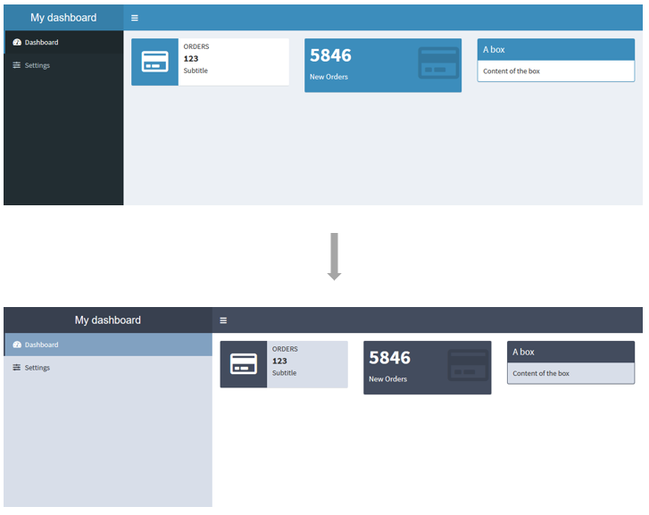

# fresh 

> Create fresh themes for use in [{shiny}](https://github.com/rstudio/shiny), [{shinydashboard}](https://github.com/rstudio/shinydashboard) and [{bs4Dash}](https://github.com/RinteRface/bs4Dash) applications and {flexdashboard} documents.

<!-- badges: start -->
[](https://CRAN.R-project.org/package=fresh)
[](https://www.repostatus.org/#active)
[](https://codecov.io/gh/dreamRs/fresh?branch=master)
[](https://www.tidyverse.org/lifecycle/#maturing)
[](https://github.com/dreamRs/fresh/actions)
<!-- badges: end -->


## Installation

You can install stable version from CRAN with:

```r
install.packages("fresh")
```

You can install the development version of fresh from GitHub with:

```r
remotes::install_github("dreamRs/fresh")
```

## shiny

Create new themes to use in shiny applications with `fluidPage` or `navbarPage`. From the default theme :


Obtain this :


This theme was creating with following code:

```r
create_theme(
  theme = "default",
  bs_vars_navbar(
    default_bg = "#3f2d54",
    default_color = "#FFFFFF",
    default_link_color = "#FFFFFF",
    default_link_active_color = "#FFFFFF"
  ),
  bs_vars_color(
    gray_base = "#354e5c",
    brand_primary = "#75b8d1",
    brand_success = "#c9d175",
    brand_info = "#758bd1",
    brand_warning = "#d1ab75",
    brand_danger = "#d175b8"
  ),
  bs_vars_state(
    success_text = "#FFF",
    success_bg = "#c9d175",
    success_border = "#c9d175",
    info_text = "#FFF",
    info_bg = "#3f2d54",
    info_border = "#3f2d54",
    danger_text = "#FFF",
    danger_bg = "#d175b8",
    danger_border = "#d175b8"
  ),
  bs_vars_wells(
    bg = "#FFF",
    border = "#3f2d54"
  ),
  output_file = "www/mytheme.css"
)
```

Use the created theme like this: 

```r
navbarPage(
  
  title = "My application",
  theme = "mytheme.css",
  
  ...
)
```


## shinydashboard

Customize colors and other settings used in [{shinydashboard}](https://github.com/rstudio/shinydashboard) applications :




Create the theme:

```r
mytheme <- create_theme(
  adminlte_color(
    light_blue = "#434C5E"
  ),
  adminlte_sidebar(
    width = "400px",
    dark_bg = "#D8DEE9",
    dark_hover_bg = "#81A1C1",
    dark_color = "#2E3440"
  ),
  adminlte_global(
    content_bg = "#FFF",
    box_bg = "#D8DEE9", 
    info_box_bg = "#D8DEE9"
  )
)
```

Use your theme:

```r
dashboardPage(
  header = dashboardHeader(title = "My dashboard"),
  sidebar = dashboardSidebar(
    # ...
  ),
  body = dashboardBody(
    
    use_theme(mytheme), # <-- use the theme
    
    # ...
    
  )
)
```


See more information here: [Variables for {shinydashboard}](https://dreamrs.github.io/fresh/articles/vars-shinydashboard.html) or in R console: `vignette("vars-shinydashboard", package = "fresh")`.


## bs4Dash

Create a theme to personalize your [{bs4Dash}](https://github.com/RinteRface/bs4Dash) applications:


Create the theme:

```r
mytheme <- create_theme(
  bs4dash_vars(
    navbar_light_color = "#bec5cb",
    navbar_light_active_color = "#FFF",
    navbar_light_hover_color = "#FFF"
  ),
  bs4dash_yiq(
    contrasted_threshold = 10,
    text_dark = "#FFF", 
    text_light = "#272c30"
  ),
  bs4dash_layout(
    main_bg = "#353c42"
  ),
  bs4dash_sidebar_light(
    bg = "#272c30", 
    color = "#bec5cb",
    hover_color = "#FFF",
    submenu_bg = "#272c30", 
    submenu_color = "#FFF", 
    submenu_hover_color = "#FFF"
  ),
  bs4dash_status(
    primary = "#5E81AC", danger = "#BF616A", light = "#272c30"
  ),
  bs4dash_color(
    gray_900 = "#FFF"
  )
)
```

Use your theme:

```r
bs4DashPage(
  title = "bs4Dash custom theme",
  navbar = bs4DashNavbar(skin = "light"),
  sidebar = bs4DashSidebar(
    title = "bs4Dash custom theme",
    skin = "light",
    
    # ...
    
  ),
  body = bs4DashBody(
    
    use_theme(mytheme), # <-- use the theme
    
    # ...
    
  )
)
```


See more information here: [Variables for {bs4dash}](https://dreamrs.github.io/fresh/articles/vars-bs4dash.html) or in R console: `vignette("vars-bs4dash", package = "fresh")`.


