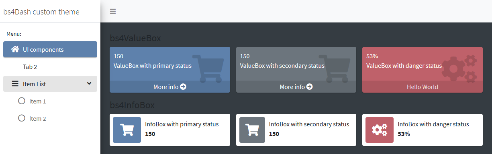
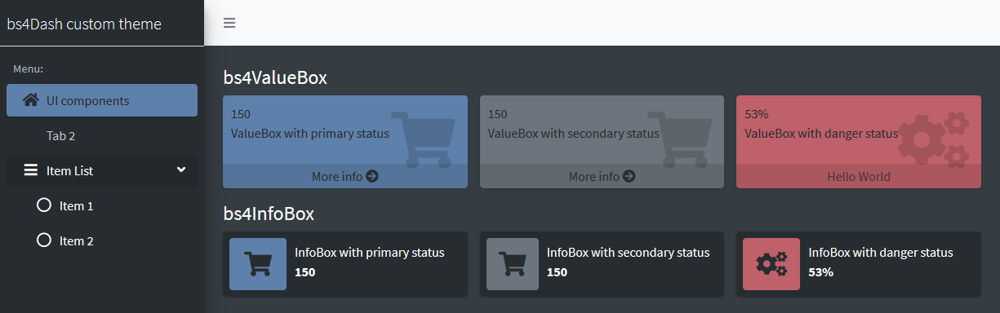
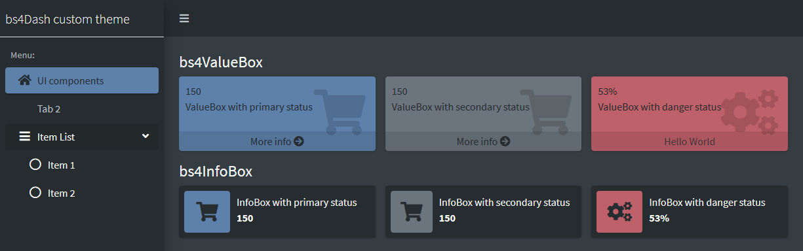
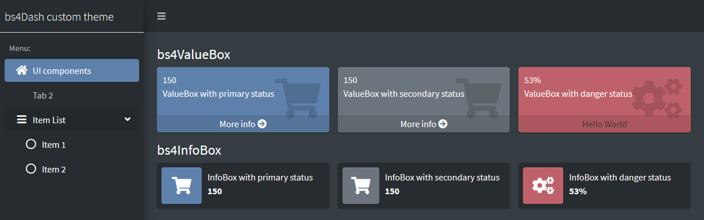

```{r, include = FALSE}
knitr::opts_chunk$set(
  collapse = TRUE,
  comment = "#>",
  results = "hide"
)
```

```{r setup}
library(fresh)
```


[{bsh4Dash}](https://github.com/RinteRface/bs4Dash) allow to construct dashboards in Shiny with latest version of [AdminLTE](https://github.com/ColorlibHQ/AdminLTE) based on Bootstrap 4, {bs4Dash} usage is close to {shinydashboard}. You can create a custom theme to use with it with functions `bs4dash_*`. Here are some examples of what you can change.


## Main statuses 

Main colors of {bs4Dash} are defined in 6 status, you can use those status in `infoBox`, `valueBox`, `cards`, ... The primary color (<span style='width:12px;height:12px;background:#007bff;border-radius:2px;display:inline-block;'></span>) is also used to highlight active elements, so it's present everywhere. Below is an example by changing the color of the "primary" and "danger" statuses:


```{r}
bs4dash_status(primary = "#5E81AC", danger = "#BF616A")
```


With classic statuses from {bs4Dash}, it look like:

</img>

With our new theme, we have changed the color of boxes and active element in sidebar:

</img>


## Layout

Layout variables allow you to change the width of the sidebar, as well as the width of the controlbar (right sidebar). And also the main background:

```{r}
bs4dash_layout(main_bg = "#353c42")
```

Result is:

</img>

The text is not readable on a black background but fortunately we will be able to change that.


## Colors

We can invert colors used for text by changing colors variables:

```{r}
bs4dash_color(gray_900 = "#FFF", white = "#272c30")
```

</img>

Now the body looks good, we can deal with the sidebar and the navbar. Text in boxes is less readable, but again this can be fixed later.


## Sidebar

In {bs4Dash} there's two skins for the sidebar: light or dark, here we have used the light one, and we can override its defaults to have a fully custom one with:

```{r}
bs4dash_sidebar_light(
  bg = "#272c30",
  color = "#bec5cb",
  hover_color = "#FFF",
  submenu_bg = "#272c30", 
  submenu_color = "#FFF",
  submenu_hover_color = "#FFF"
)
```


We now have:

</img>


## Navbar

Background color of the navbar is defined by the light or dark status, then we can change default with xustom variables:

```{r}
bs4dash_status(light = "#272c30")

bs4dash_vars(
  navbar_light_color = "#bec5cb",
  navbar_light_active_color = "#FFF",
  navbar_light_hover_color = "#FFF"
)
```

Like the sidebar, we could have used "dark" instead of "light". To find available variables, you can use: `search_vars_bs4dash("navbar")`.

Here's the result:

</img>


## Color contrast

Last set of variables that we can use to finalize our new theme is the YIQ color contrast variables that allow to swith color if contrast is below a threshold. 


```{r}
bs4dash_yiq(contrasted_threshold = 10, text_dark = "#FFF", text_light = "#272c30")
```

Now text is more readable:

</img>


## Full theme

Here the code to create this theme:

```{r, eval=FALSE}
create_theme(
  bs4dash_vars(
    navbar_light_color = "#bec5cb",
    navbar_light_active_color = "#FFF",
    navbar_light_hover_color = "#FFF"
  ),
  bs4dash_yiq(
    contrasted_threshold = 10,
    text_dark = "#FFF", 
    text_light = "#272c30"
  ),
  bs4dash_layout(
    main_bg = "#353c42"
  ),
  bs4dash_sidebar_light(
    bg = "#272c30", 
    color = "#bec5cb",
    hover_color = "#FFF",
    submenu_bg = "#272c30", 
    submenu_color = "#FFF", 
    submenu_hover_color = "#FFF"
  ),
  bs4dash_status(
    primary = "#5E81AC", danger = "#BF616A", light = "#272c30"
  ),
  bs4dash_color(
    gray_900 = "#FFF"
  )
)
```


