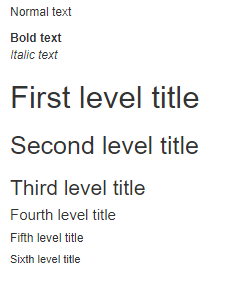
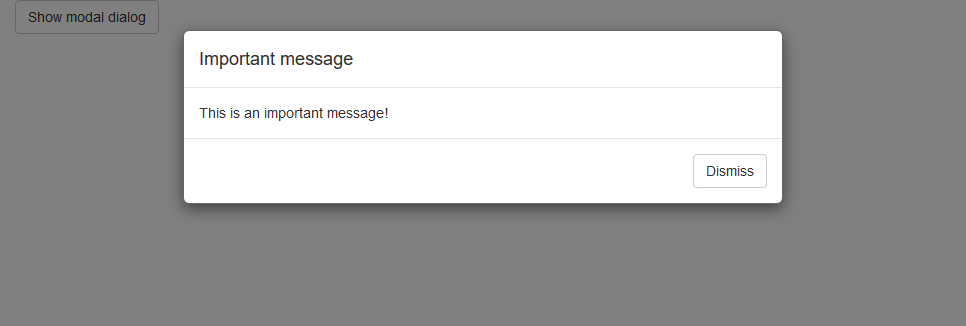
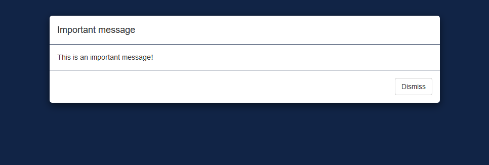

<link rel="stylesheet" type="text/css" href="assets/bootstrap-default.min.css"/>
<link rel="stylesheet" type="text/css" href="assets/bootstrap-custom.min.css"/>

```{r, include = FALSE}
knitr::opts_chunk$set(
  collapse = TRUE,
  comment = "#>"
)
```

```{r setup}
library(fresh)
library(shiny)
library(shinyWidgets)
library(htmltools)
```


```{r, echo=FALSE}
# tags$link(rel = "stylesheet", type = "text/css", href = "assets/bootstrap-default.min.css")
# tags$link(rel = "stylesheet", type = "text/css", href = "assets/bootstrap-custom.min.css")
```

```{css, echo=FALSE}
.two-cols {
  display: grid;
  grid-template-columns: repeat(2, 1fr);
  grid-template-rows: 1fr;
  grid-column-gap: 10px;
  grid-row-gap: 0px;
}
```


{shiny} is powered by [Bootstrap](https://getbootstrap.com/docs/3.4/), the main components are personalizable using a large number of variables. Below, we give some examples of parameters that you can modify to change the appearance of elements created by {shiny} functions.


## Buttons

Buttons and their variants can be modified by variables from `bs_vars_button()`. Here we create square buttons with bold labels and custom colors:

:::::: {.default-theme .row}

::: {.default-theme .col-sm-6}

{shiny} code:

```{r buttons}
buttons <- tagList(
  actionButton(
    "default", "Default"
  ),
  actionButton(
    "primary", "Primary", 
    class = "btn-primary"
  )
)
```

:::

::: {.default-theme .col-sm-6}

{fresh} variables:

```{r, eval=FALSE}
bs_vars_button(
  font_weight = 500,
  border_radius_base = 0,
  default_color = "#112446",
  default_border = "#112446",
  primary_color = "#FFF",
  primary_bg = "#112446",
  primary_border = "#112446"
)
```

:::

::::::
</br>

With default theme, it will render as:

```{r, echo=FALSE}
tags$div(
  class = "default-theme",
  buttons
)
```


With our {fresh} theme it will look like:

```{r, echo=FALSE}
tags$div(
  class = "custom-theme",
  buttons
)
```


## Status

Buttons like several components in Bootstrap are styled wit statuses colors, there's 5 options: primary, success, danger, warning and info. It's possible with `bs_vars_color()` to modify theses colors to alter all components depending on them:


:::::: {.two-cols}

::: {}

{shiny} code:

```{r colors}
btn <- function(x)
  actionButton(
    x, x, 
    class = paste0("btn-", x)
  )

colors <- tagList(
  btn("primary"),
  btn("success"),
  btn("info"),
  btn("warning"),
  btn("danger"),
  tags$p(""),
  shinyWidgets::progressBar(
    "pb1", value = 80,
    status = "primary", 
    display_pct = TRUE
  )
)
```

:::

::: {}

{fresh} variables:

```{r, eval=FALSE}
bs_vars_color(
  brand_primary = "#112446",
  brand_success = "#7bc043",
  brand_info = "#0392cf",
  brand_warning = "#f37736",
  brand_danger = "#ee4035"
)
```

:::

::::::
     


</br></br>


With default theme, it will render as:

```{r, echo=FALSE}
htmlDependencies(colors[[length(colors)]]) <- NULL
tags$div(
  class = "default-theme",
  colors
)
```


With our {fresh} theme it will look like:

```{r, echo=FALSE}
tags$div(
  class = "custom-theme",
  colors
)
```


## Navbar

If you use `shiny::navbarPage`, you can customize colors with `bs_vars_navbar()`:

:::::: {.two-cols}

::: {}

{shiny} code:

```{r navbar}
navbar <- navbarPage("App Title",
  tabPanel("Plot"),
  tabPanel("Summary"),
  tabPanel("Table")
)
```

:::

::: {}

{fresh} variables:

```{r, eval=FALSE}
bs_vars_navbar(
  padding_horizontal = "15px",
  default_bg = "#112446",
  default_color = "#FFFFFF",
  default_link_color = "#FFFFFF",
  default_link_active_color = "#FFFFFF",
  default_link_hover_color = "#A4A4A4"
)
```

:::

::::::


With default theme, it will render as:

```{r, echo=FALSE}
tags$div(
  class = "default-theme",
  navbar
)
```


With our {fresh} theme it will look like:

```{r, echo=FALSE}
tags$div(
  class = "custom-theme",
  navbar
)
```


## wellPanel

In {shiny}, `wellPanel` create a box with a grey background, it's also used in `sidebarPanel()`, you can change these default settings with `bs_vars_wells()`:


:::::: {.two-cols}

::: {}

{shiny} code:

```{r well}
well <- wellPanel(
  "This is a wellPanel (or sidebarPanel)"
)
```

:::

::: {}

{fresh} variables:

```{r, eval=FALSE}
bs_vars_wells(
  bg = "#FFF",
  border = "#3f2d54"
)
```

:::

::::::


With default theme, it will render as:

```{r, echo=FALSE}
tags$div(
  class = "default-theme",
  well
)
```


With our {fresh} theme it will look like:

```{r, echo=FALSE}
tags$div(
  class = "custom-theme",
  well
)
```


## Global

`bs_vars_global()` allow to define some global options like background and text color, but also the number of columns in the grid system (when using `fluidRow`) :

:::::: {.two-cols}

::: {}

{shiny} code:

```{r grid}
grid <- tagList(
  fluidRow(
    tags$div(
      class = "col-sm-15", 
      wellPanel("width=15 - 2 columns")
    ),
    tags$div(
      class = "col-sm-15",
      wellPanel("width=15 - 2 columns")
    )
  ),
  fluidRow(
    tags$div(
      class = "col-sm-10", 
      wellPanel("width=10 - 3 columns")
    ),
    tags$div(
      class = "col-sm-10", 
      wellPanel("width=10 - 3 columns")
    ),
    tags$div(
      class = "col-sm-10", 
      wellPanel("width=10 - 3 columns")
    )
  ),
  fluidRow(
    column(width = 6, wellPanel("width=6 - 5 columns")),
    column(width = 6, wellPanel("width=6 - 5 columns")),
    column(width = 6, wellPanel("width=6 - 5 columns")),
    column(width = 6, wellPanel("width=6 - 5 columns")),
    column(width = 6, wellPanel("width=6 - 5 columns"))
  )
)
```

:::

::: {}

{fresh} variables:

```{r, eval=FALSE}
bs_vars_global(
  grid_columns = 30,
  grid_gutter_width = "15px"
)
```

:::

::::::

In the first two examples, we can't use `column` because it's limited to a maximum width of 12.


With default theme, it will render as:

```{r, echo=FALSE}
tags$div(
  class = "default-theme",
  tagList(
    fluidRow(
      column(width = 6, wellPanel("width=6 - 2 columns")),
      column(width = 6, wellPanel("width=6 - 2 columns"))
    ),
    fluidRow(
      column(width = 4, wellPanel("width=4 - 3 columns")),
      column(width = 4, wellPanel("width=4 - 3 columns")),
      column(width = 4, wellPanel("width=4 - 3 columns"))
    )
  )
)
```


With our {fresh} theme it will look like:

```{r, echo=FALSE}
tags$div(
  class = "custom-theme",
  grid
)
```


Here we now have a grid system where it's possible to have 5 columns.


## tabPanel

Default `tabPanel` can be customized with `bs_vars_tabs()`, if `type = "pills"` in `tabsetPanel`, use `bs_vars_pills()`. Some options are common to both and can be set in `bs_vars_nav()`.

:::::: {.two-cols}

::: {}

{shiny} code:

```{r tabs}
tabs <- tabsetPanel(
  tabPanel("Plot"),
  tabPanel("Summary"),
  tabPanel("Table")
)
```

:::

::: {}

{fresh} variables:

```{r, eval=FALSE}
bs_vars_tabs(
  border_color = "#112446",
  active_link_hover_bg = "#FFF",
  active_link_hover_color = "#112446",
  active_link_hover_border_color = "#112446",
  link_hover_border_color = "#112446"
)
```

:::

::::::


With default theme, it will render as:

```{r, echo=FALSE}
tags$div(
  class = "default-theme",
  tabs
)
```


With our {fresh} theme it will look like:

```{r, echo=FALSE}
tags$div(
  class = "custom-theme",
  tabs
)
```


## Font size

Font size can be set with `bs_vars_font`, the argument `size_base` is the base font size, meaning that other sizes are calculated from this value, nonetheless you set absolute size for headings if you want.


:::::: {.two-cols}

::: {}

{shiny} code:

```{r font}
font <- tagList(
  tags$p("Normal text"),
  tags$b("Bold text"),
  tags$i("Italic text"),
  tags$h1("First level title"),
  tags$h2("Second level title"),
  tags$h3("Third level title"),
  tags$h4("Fourth level title"),
  tags$h5("Fifth level title"),
  tags$h6("Sixth level title")
)
```

:::

::: {}

{fresh} variables:

```{r, eval=FALSE}
bs_vars_font(
  size_base = "12px"
)
```

:::

::::::


:::::: {.two-cols}

::: {}

With default theme, it will render as:


:::

::: {}


With our {fresh} theme it will look like:



:::

::::::


## Modal

Modal create with `modalDialog` can be customized with `bs_vars_modal()`, you can change the width of the window, the overlay color behind the modal and its opacity.

For example, here's a modal with 80% width and an opaque background:

```{r, eval=FALSE}
bs_vars_modal(
  md = "80%",backdrop_bg = "#112446",
  backdrop_opacity = 1,
  header_border_color = "#112446",
  footer_border_color = "#112446"
)
```


With default theme, it will render as:

</img>


With our {fresh} theme it will look like:

</img>


