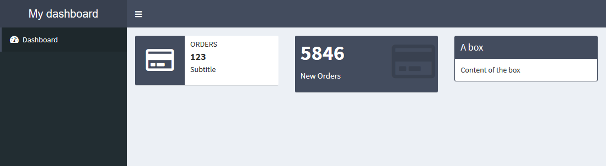
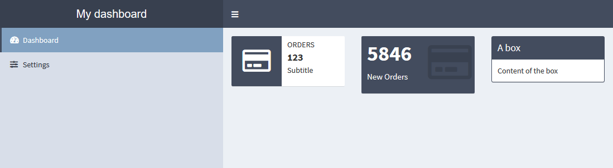
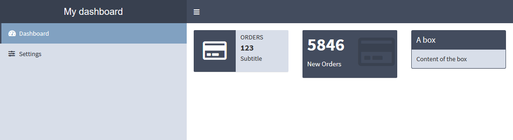

```{r, include = FALSE}
knitr::opts_chunk$set(
  collapse = TRUE,
  comment = "#>",
  results = "hide"
)
```

```{r setup}
library(fresh)
```

[{shinydashboard}](https://github.com/rstudio/shinydashboard) is powered by [AdminLTE](https://adminlte.io/themes/AdminLTE/index2.html), with variables from `adminlte_*` functions, you can customize the appearance of your dashboard. Here are some examples of what you can change.


## Colors

There's a fixed list of colors that you can use in `valueBox`, `infoBox`, `box`, but which are also used for other components like the header. Some colors are associated with a status, for example in `valueBox` you can use `color = "light-blue"`, but in `box` you have to use `status = "pimary"` for the same color. The function `adminlte_color()` allow you to define thoses colors:

With the following code we are gonna change the light-blue color that is also the color for the primary status and for the header:

```{r}
adminlte_color(
  light_blue = "#086A87"
)
```

With classic colors from {shinydashboard}, it look like:

</img>

With our new theme, we have changed the color of four elements:

</img>


Here, we have modified only one color, but you can set values for all the other ones.


## Sidebar

One of the main features of {shinydashboard} is the side menu, which can be modified with `adminlte_sidebar()`.

In the example below, we change the default width of the sidebar as well as its color:

```{r}
adminlte_sidebar(
  width = "400px",
  dark_bg = "#D8DEE9",
  dark_hover_bg = "#81A1C1",
  dark_color = "#2E3440"
)
```


With classic colors from {shinydashboard}, it look like:

</img>

With our new theme:

</img>


## Body

Last set of variables you can use, are for changing background color of the body itself and boxes.

```{r}
adminlte_global(
  content_bg = "#FFFFFF",
  box_bg = "#D8DEE9", 
  info_box_bg = "#D8DEE9"
)
```


With classic colors from {shinydashboard}, it look like:

</img>

With our new theme:

</img>


## Full application

Here's the code to create the theme and use it in a dashboard application:

```{r, eval=FALSE}
library(fresh)
# Create the theme
mytheme <- create_theme(
  adminlte_color(
    light_blue = "#434C5E"
  ),
  adminlte_sidebar(
    width = "400px",
    dark_bg = "#D8DEE9",
    dark_hover_bg = "#81A1C1",
    dark_color = "#2E3440"
  ),
  adminlte_global(
    content_bg = "#FFF",
    box_bg = "#D8DEE9", 
    info_box_bg = "#D8DEE9"
  )
)


library(shiny)
library(shinydashboard)

ui <- dashboardPage(
  header = dashboardHeader(title = "My dashboard"),
  sidebar = dashboardSidebar(
    sidebarMenu(
      menuItem("Dashboard", tabName = "dashboard", icon = icon("dashboard")),
      menuItem("Settings", tabName = "settings", icon = icon("sliders"))
    )
  ),
  body = dashboardBody(
    
    use_theme(mytheme), # <-- use the theme
    
    tabItems(
      tabItem(
        "dashboard",
        
        # infoBoxes
        fluidRow(
          infoBox(
            "Orders", "123", "Subtitle", icon = icon("credit-card"),
            color = "light-blue"
          ),
          valueBox(
            5846, "New Orders", icon = icon("credit-card"),
            color = "light-blue"
          ),
          box(
            title = "A box", solidHeader = TRUE, width = 4,
            status = "primary",
            "Content of the box"
          )
        )
      )
    )
  )
)

server <- function(input, output, session) {
  
}

shinyApp(ui, server)
```


